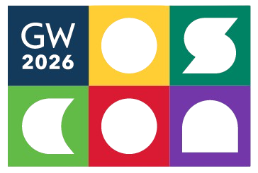
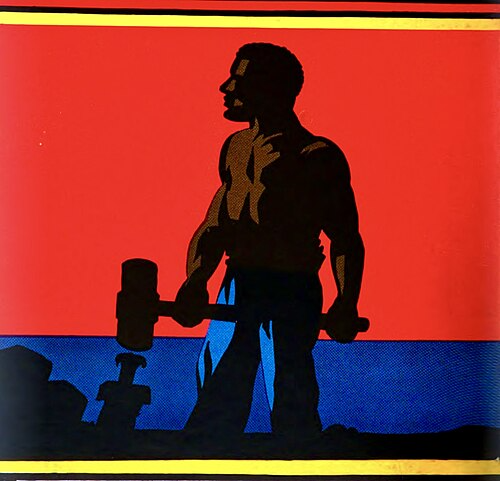
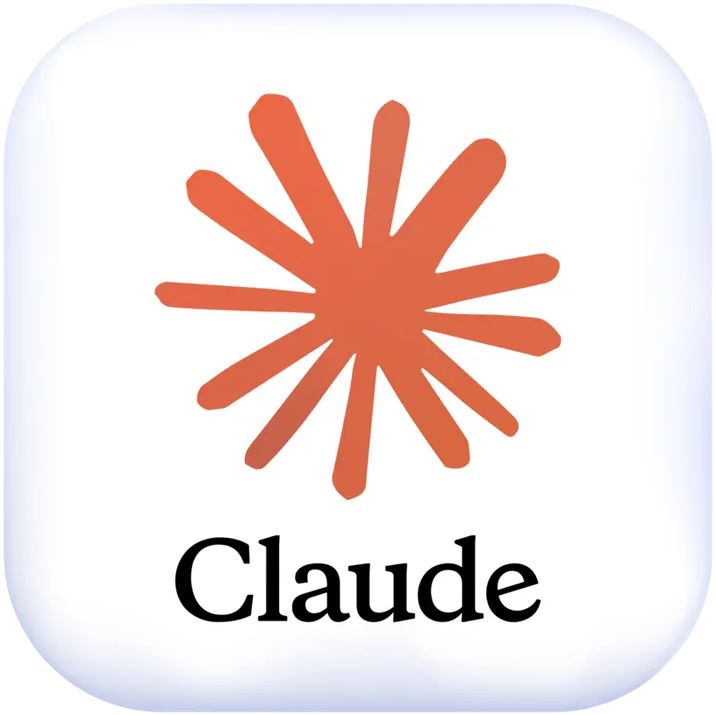
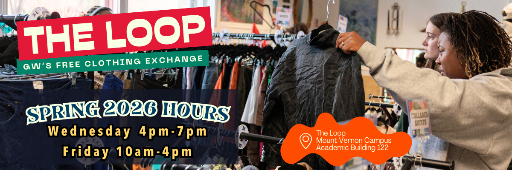
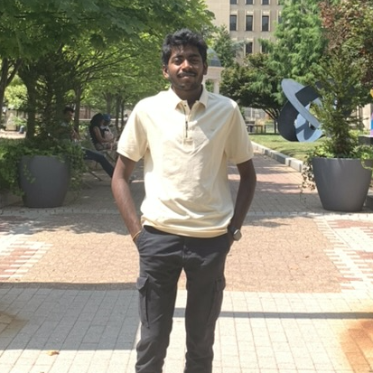
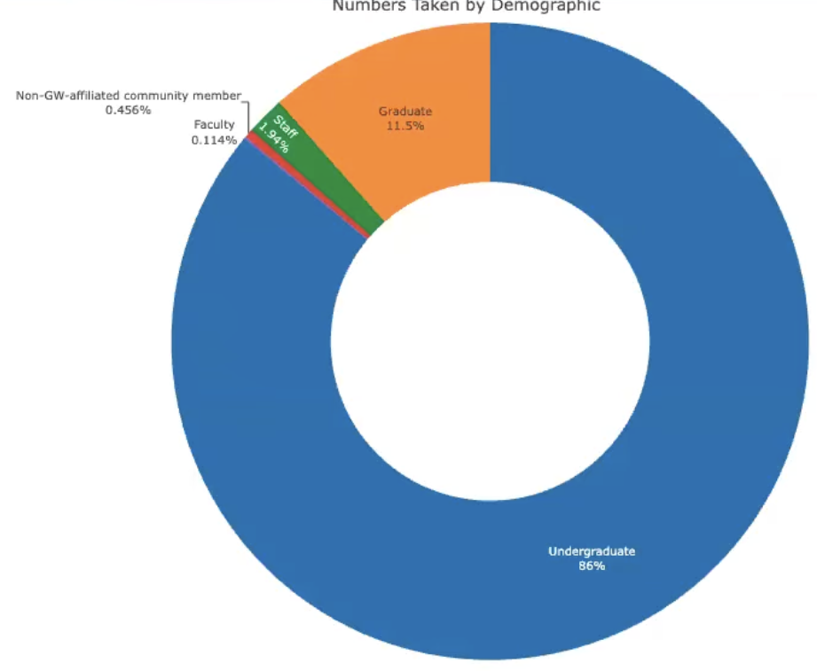
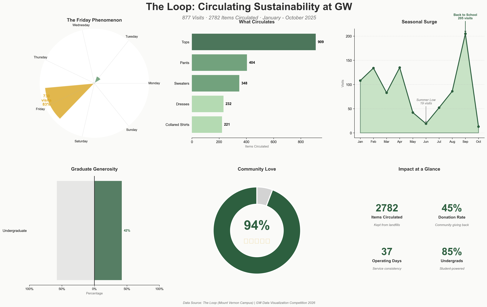
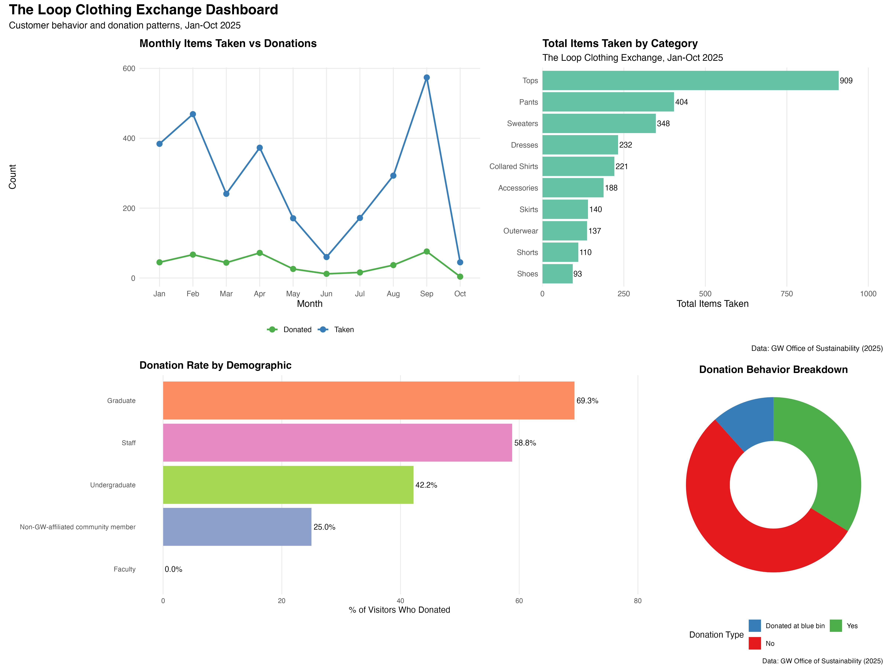
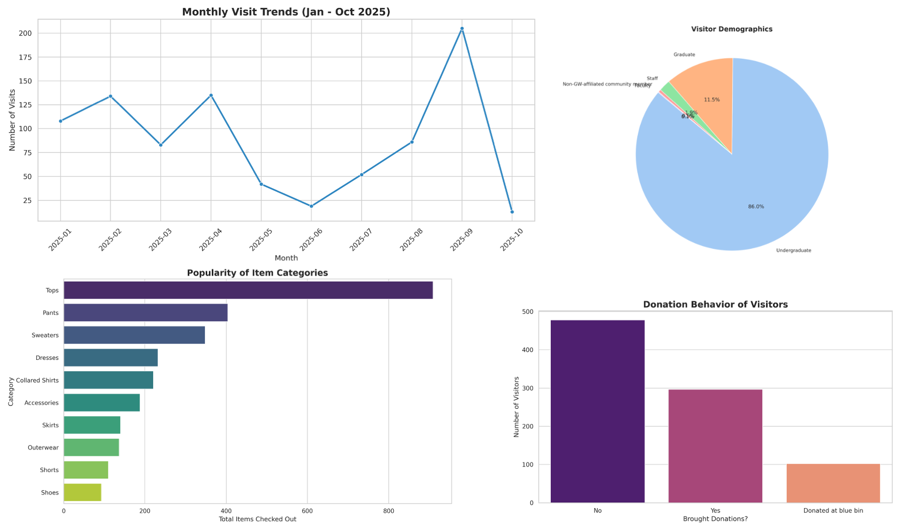
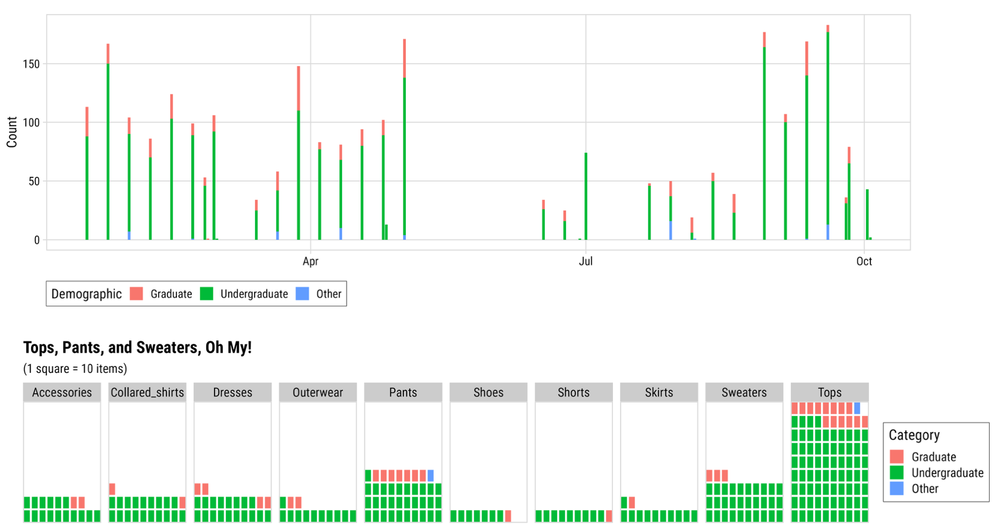

```{r setup, include=FALSE}
library(knitr)
library(fontawesome)
library(tidyverse)
library(metathis)
library(logitr)

options(
  htmltools.dir.version = FALSE,
  knitr.table.format = "html",
  knitr.kable.NA = '',
  dplyr.width = Inf,
  width = 250
)

knitr::opts_chunk$set(
  cache = FALSE,
  warning = FALSE,
  message = FALSE,
  fig.path = "figs/",
  fig.width = 7.252,
  fig.height = 4,
  comment = "#>",
  fig.retina = 3
)

knitr::opts_chunk$set(
    warning = FALSE,
    message = FALSE,
    comment = "#>",
    fig.path = "figs/",
    fig.retina = 3 # Better figure resolution
)
```

layout: true

<!-- this adds the link footer to all slides, depends on my-footer class in css-->

<div class="footer-small">
<span>
https://github.com/jhelvy/2026-oscon-ai-dataviz-challenge
</span>
</div>

---

name: title-slide
class: inverse, middle

# JP vs. AI 

## A Modern "John Henry Style" Dataviz Challenge

.leftcol60[

### by John Paul Helveston

### 2026 OSCON @ GWU

]

.rightcol40[

<br><center>

</center>

]

---

# .center[Who would win?]

.leftcol[

## .center[John Henry]

<center>

</center>

.font80[https://en.wikipedia.org/wiki/John_Henry_(folklore)]

]

.rightcol[

## .center[Steam Drill]

<center>

</center>

.font80[https://www.reddit.com/r/HistoryMemes/comments/m5rtt4/the_legend_of_john_henry/]

]

---

# .center[Who would win?]

.leftcol[

## .center[John Helveston]

<center>

</center>

]

.rightcol[

## .center[AI]

<center>

</center>

]

---

class:center

# GW LAI Data Visualization Competition

<br>
<center>

</center>

https://libguides.gwu.edu/love-data-week/data-viz-2026

---

.cols3[

# .center[Pingfan Hu]

### .center[Ph.D. Student]

<center>

</center>

]

.cols3[

# .center[Nithin Sarva]

### .center[M.S. Student]

<center>

</center>

]

.cols3[

# .center[Eric Lehman]

### .center[B.S. Student]

<center>

</center>

]

Recording of challenge: https://youtu.be/q1oDviJDbPI?si=dLJ9H3OhFkTW0P5P

---

class:center

# Eric (Undergraduate student)

<center>

</center>

---

class: center

## Nithin (Masters student)

<center>

</center>

https://github.com/sarvanithin/Data-viz/

---

class: center

## Pingfan (Ph.D. student)

<center>

</center>

https://github.com/pingfan-hu/2026-gw-data-viz-competition

---

> MANUS PROMPT: "this is a dataset for a dataviz competition, please expore it and come up with a compelling data visualization or set of charts"

<center>

</center>

---

class:center

## JP (Faculty, w/out AI)

<center>

</center>

https://github.com/jhelvy/gw-dataviz-2026

---

class: center, middle, inverse

# Epilogue

---

class: center

## JP (w/AI - React app + D3 graphics)

<center>

</center>

https://github.com/jhelvy/gw-dataviz-2026

---

class: inverse

<br>

.leftcol70[

# .center[.font150[Thanks!]]

Slides:<br>https://github.com/jhelvy/2026-oscon-ai-dataviz-challenge/

]

.rightcol30[.right[

<br><br><br><br><br><br><br><br><br><br>
@jhelvy.bsky.social `r fa(name = "bluesky", fill = "white")`<br>
@jhelvy `r fa(name = "github", fill = "white")`<br>
jhelvy.com `r fa(name = "link", fill = "white")`<br>
jph@gwu.edu `r fa(name = "paper-plane", fill = "white")`<br>
https://jhelvy.com/slides
]]
